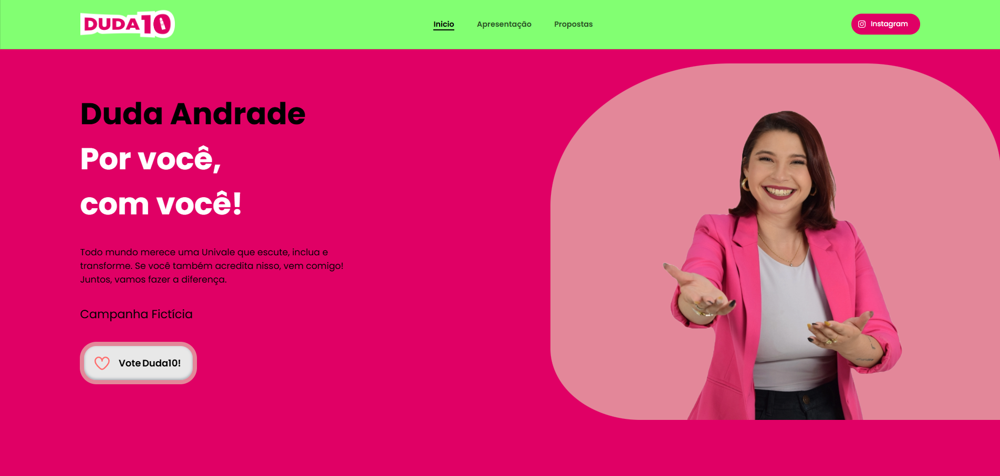

<h1 align="center"> Duda10 - Campanha Univale </h1>

Site fictício de campanha universitária, criado para apresentar propostas, história e identidade da candidata Duda Andrade.

  <a href="#-tecnologias">Tecnologias</a>&nbsp;&nbsp;&nbsp;|&nbsp;&nbsp;&nbsp;
  <a href="#-projeto">Projeto</a>&nbsp;&nbsp;&nbsp;|&nbsp;&nbsp;&nbsp;
  <a href="#-layout">Layout</a>&nbsp;&nbsp;&nbsp;|&nbsp;&nbsp;&nbsp;
  <a href="#-demonstração">Demo</a>&nbsp;&nbsp;&nbsp;|&nbsp;&nbsp;&nbsp;
  <a href="#memo-licença">Licença</a>

  

 

  

## 🚀 Tecnologias

Esse projeto foi desenvolvido com as seguintes tecnologias:

- HTML5
- CSS3 (com organização modular)
- JavaScript (jQuery e ScrollReveal)

## 💻 Projeto

O site apresenta a candidata Duda Andrade, suas propostas para a Univale, sua trajetória e identidade política. Conta com layout responsivo, animações e interação para engajar estudantes.

## 🎨 Layout

O layout é moderno, colorido e responsivo, com destaque para as seções de apresentação, propostas e botão animado de "voto".

## 💻 Demonstração

https://irwayne.github.io/Projeto-Duda10/

---

Feito por Irwayne Taborda!
